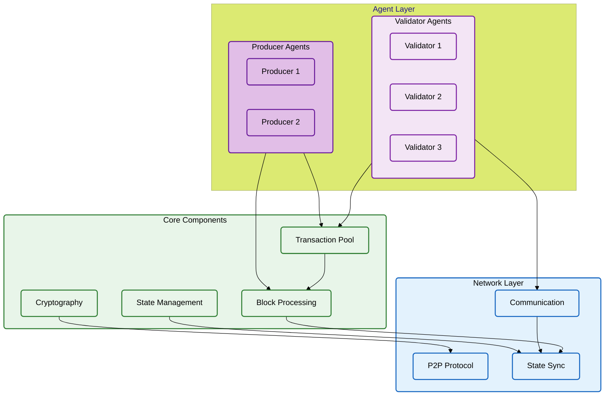
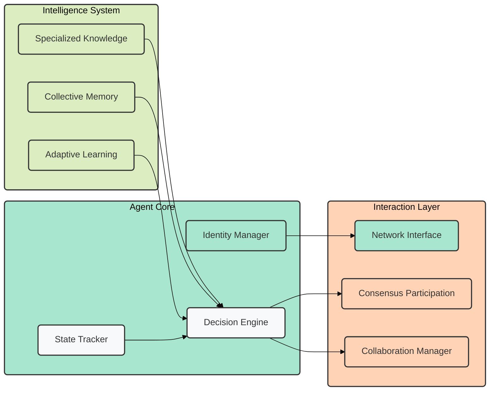
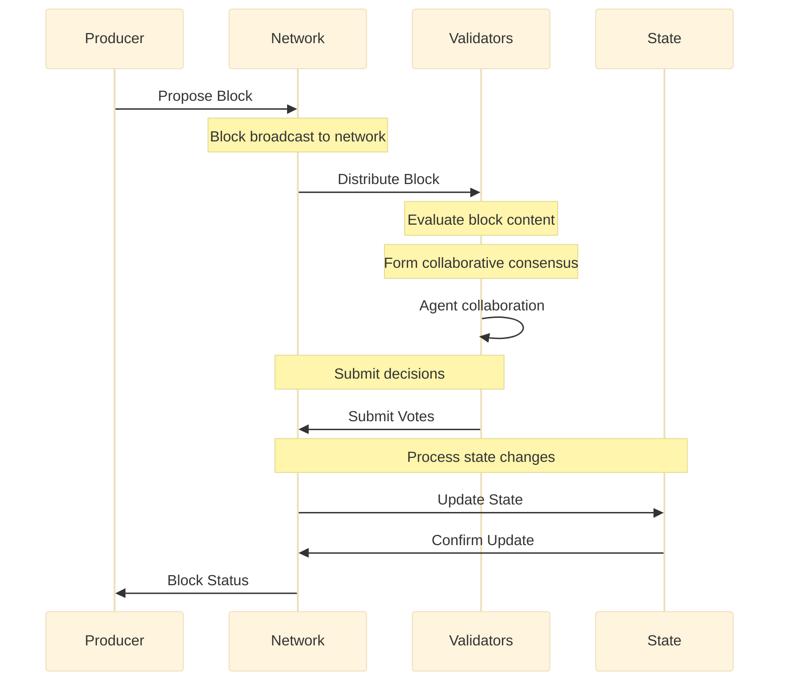
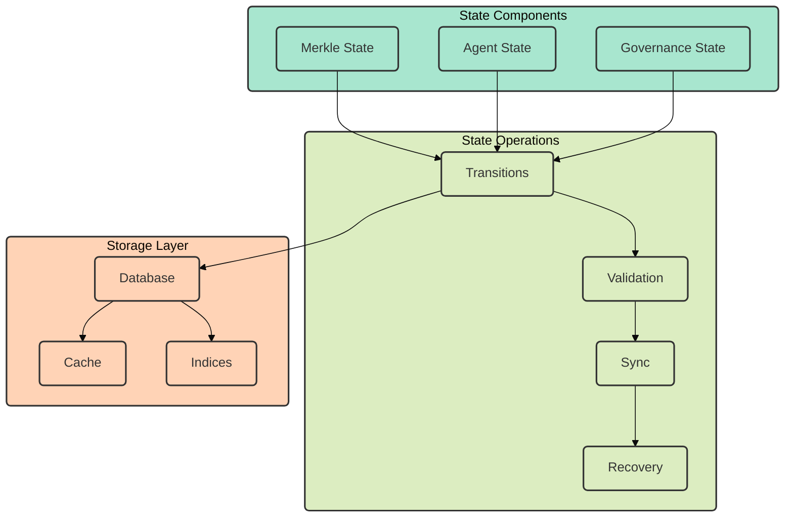
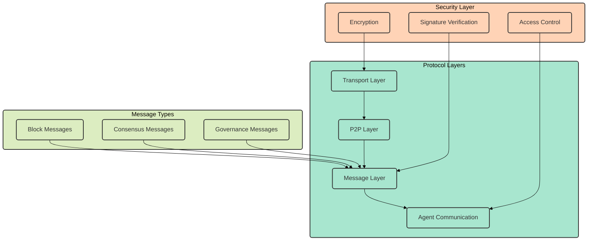
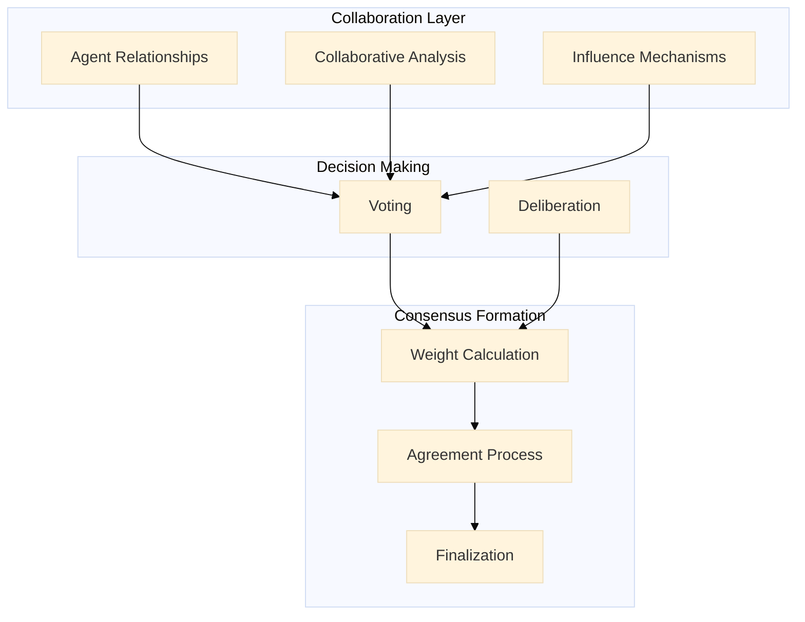
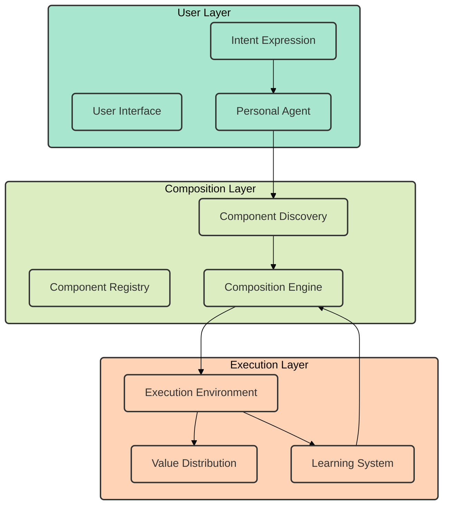
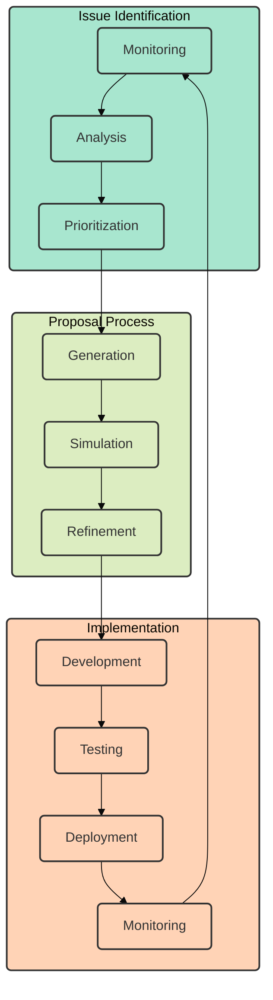
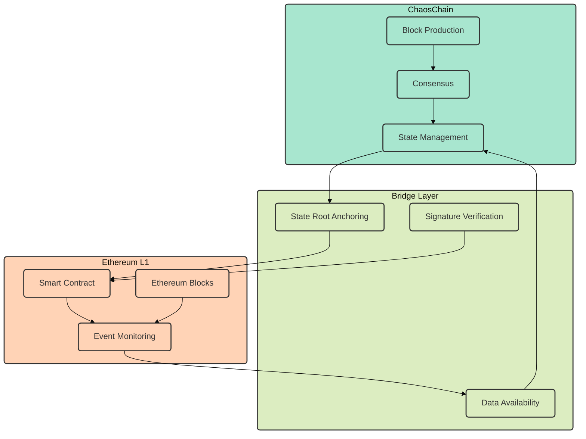

# ChaosChain Architecture

ChaosChain implements a novel blockchain architecture that combines autonomous AI agents and emergent consensus for decentralized decision-making. Below are the key architectural components and their interactions.

## System Overview

The system is composed of three main layers that work together to create a dynamic and adaptive blockchain network.

## Agent Architecture

Each agent in ChaosChain is composed of three main systems that enable intelligent decision-making and collaborative interaction.

## Consensus Flow

The consensus process follows a structured flow involving multiple components:

## State Management

The state management system handles different types of state through a layered approach:

## Network Protocol

The network protocol is organized in distinct layers with clear responsibilities:

## Emergent Consensus System

The emergent consensus system combines multiple factors to reach agreement:

## Agentic App Layer

The Agentic App Layer enables dynamic service composition:

## Governance System

The governance system enables protocol evolution:

## Integration with Ethereum

ChaosChain integrates with Ethereum for security and interoperability:

This architecture provides the foundation for ChaosChain's vision of AI-driven blockchain governance and dynamic service composition. The system is designed to be flexible, adaptable, and capable of evolving over time through the collective intelligence of its autonomous agents. 